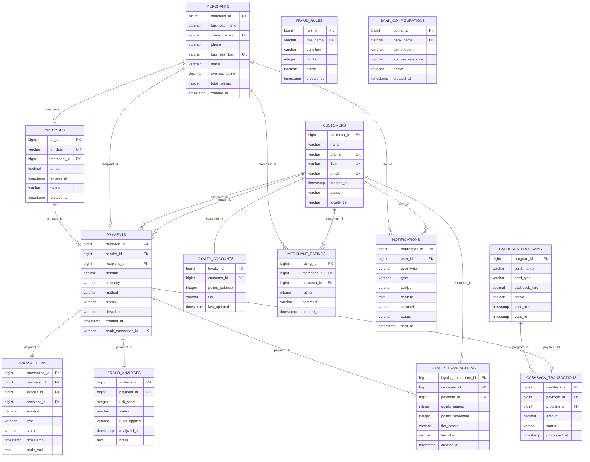
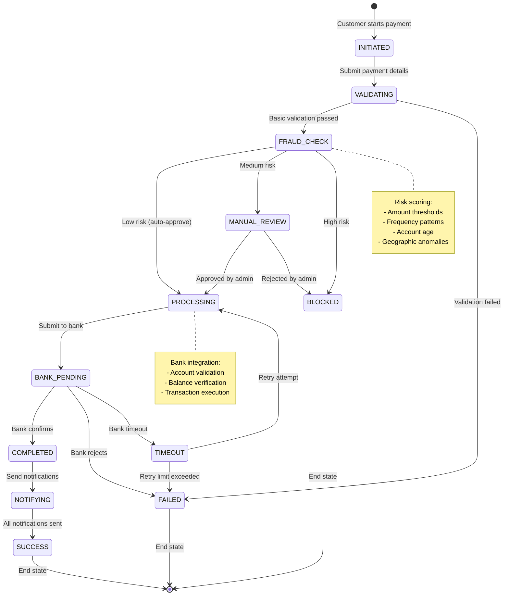
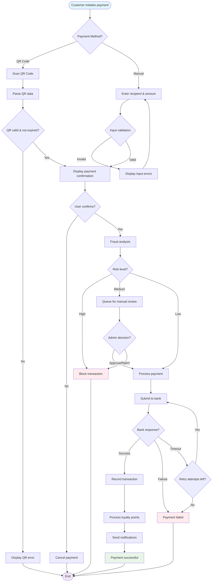
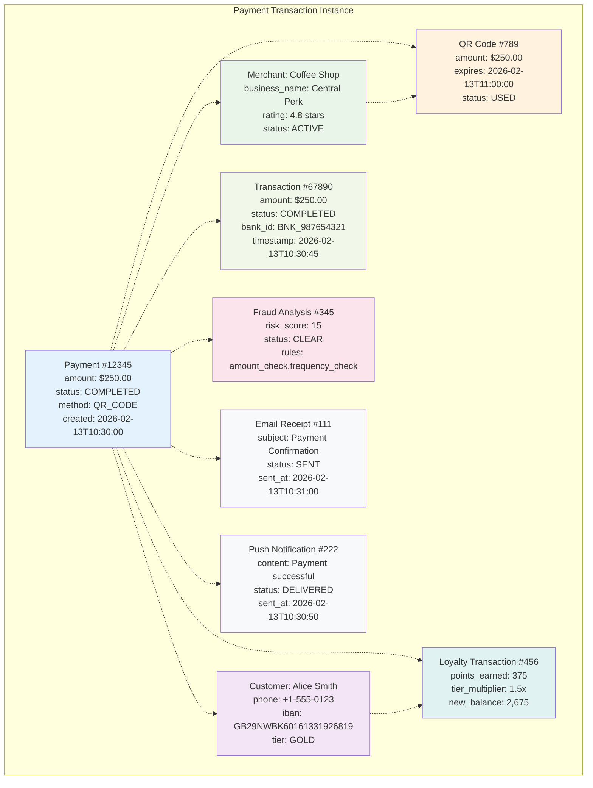

# System Architecture Diagrams

## Class Diagram

```mermaid
classDiagram
    %% Customer Domain
    class Customer {
        -Long customerId
        -String name
        -String phone
        -String iban
        -String email
        -LocalDateTime createdAt
        -CustomerStatus status
        -LoyaltyTier loyaltyTier
        +register()
        +updateProfile()
        +validateIban()
    }

    class LoyaltyAccount {
        -Long loyaltyId
        -Long customerId
        -Integer pointsBalance
        -LoyaltyTier tier
        -LocalDateTime lastUpdated
        +addPoints(amount)
        +redeemPoints(amount)
        +checkTierEligibility()
    }

    %% Merchant Domain
    class Merchant {
        -Long merchantId
        -String businessName
        -String contactEmail
        -String phone
        -String businessIban
        -MerchantStatus status
        -Double averageRating
        -Integer totalRatings
        +updateProfile()
        +calculateAverageRating()
    }

    class MerchantRating {
        -Long ratingId
        -Long merchantId
        -Long customerId
        -Integer rating
        -String comment
        -LocalDateTime createdAt
        +submitRating()
        +validateRating()
    }

    %% Payment Domain
    class Payment {
        -Long paymentId
        -Long senderId
        -Long recipientId
        -BigDecimal amount
        -String currency
        -PaymentMethod method
        -PaymentStatus status
        -String description
        -LocalDateTime createdAt
        -String bankTransactionId
        +initiate()
        +process()
        +cancel()
        +refund()
    }

    class QRCode {
        -Long qrId
        -String qrData
        -Long merchantId
        -BigDecimal amount
        -LocalDateTime expiresAt
        -QRStatus status
        +generate()
        +validate()
        +expire()
    }

    %% Transaction Domain
    class Transaction {
        -Long transactionId
        -Long paymentId
        -Long senderId
        -Long recipientId
        -BigDecimal amount
        -TransactionType type
        -TransactionStatus status
        -LocalDateTime timestamp
        -String auditTrail
        +record()
        +updateStatus()
        +generateAuditLog()
    }

    %% Fraud Domain
    class FraudAnalysis {
        -Long analysisId
        -Long paymentId
        -Integer riskScore
        -FraudStatus status
        -String rules_applied
        -LocalDateTime analyzedAt
        -String notes
        +analyzeTransaction()
        +calculateRiskScore()
        +flagSuspicious()
    }

    class FraudRule {
        -Long ruleId
        -String ruleName
        -String condition
        -Integer points
        -Boolean active
        -LocalDateTime createdAt
        +evaluate(payment)
        +activate()
        +deactivate()
    }

    %% Notification Domain
    class Notification {
        -Long notificationId
        -Long userId
        -NotificationType type
        -String subject
        -String content
        -NotificationChannel channel
        -NotificationStatus status
        -LocalDateTime sentAt
        +send()
        +markAsRead()
        +retry()
    }

    %% Cashback Domain
    class CashbackProgram {
        -Long programId
        -String bankName
        -String cardType
        -BigDecimal cashbackRate
        -Boolean active
        -LocalDateTime validFrom
        -LocalDateTime validTo
        +calculateCashback()
        +isEligible()
        +activate()
    }

    class CashbackTransaction {
        -Long cashbackId
        -Long paymentId
        -Long programId
        -BigDecimal amount
        -CashbackStatus status
        -LocalDateTime processedAt
        +process()
        +reverse()
    }

    %% Bank Integration Domain
    class BankAdapter {
        -String bankName
        -String apiEndpoint
        -Boolean active
        +processPayment(payment)
        +validateAccount(iban)
        +checkBalance(account)
    }

    %% Enums
    class CustomerStatus {
        <<enumeration>>
        ACTIVE
        INACTIVE
        SUSPENDED
    }

    class LoyaltyTier {
        <<enumeration>>
        SILVER
        GOLD
        PLATINUM
    }

    class PaymentStatus {
        <<enumeration>>
        PENDING
        PROCESSING
        COMPLETED
        FAILED
        CANCELLED
    }

    class PaymentMethod {
        <<enumeration>>
        QR_CODE
        MANUAL
        BANK_TRANSFER
    }

    class FraudStatus {
        <<enumeration>>
        CLEAR
        SUSPICIOUS
        BLOCKED
        UNDER_REVIEW
    }

    class NotificationType {
        <<enumeration>>
        PAYMENT_CONFIRMATION
        EMAIL_RECEIPT
        FRAUD_ALERT
        LOYALTY_UPDATE
        TIER_UPGRADE
    }

    %% Relationships
    Customer ||--o{ Payment : "sends/receives"
    Customer ||--|| LoyaltyAccount : "has"
    Customer ||--o{ MerchantRating : "gives"

    Merchant ||--o{ Payment : "receives"
    Merchant ||--o{ QRCode : "generates"
    Merchant ||--o{ MerchantRating : "receives"

    Payment ||--|| Transaction : "creates"
    Payment ||--o| FraudAnalysis : "analyzed by"
    Payment ||--o{ Notification : "triggers"
    Payment ||--o| CashbackTransaction : "eligible for"

    QRCode ||--o| Payment : "initiates"

    FraudRule ||--o{ FraudAnalysis : "applied in"

    CashbackProgram ||--o{ CashbackTransaction : "applies to"

    Customer ||--o{ Notification : "receives"
    Merchant ||--o{ Notification : "receives"
```

## Entity Relationship Diagram



## State Diagram - Payment Lifecycle



## Activity Diagram - Payment Flow



## Flowchart - Fraud Detection Logic

```mermaid
flowchart TD
    Start([Transaction submitted])
    InitScore[Initialize risk score = 0]

    Start --> InitScore
    InitScore --> AmountCheck{Amount > $10,000?}

    AmountCheck -->|Yes| HighAmount[Add 50 points]
    AmountCheck -->|No| MediumAmount{Amount > $5,000?}

    MediumAmount -->|Yes| MedAmountAdd[Add 25 points]
    MediumAmount -->|No| LowAmount{Amount > $1,000?}

    LowAmount -->|Yes| LowAmountAdd[Add 10 points]
    LowAmount -->|No| FrequencyCheck

    HighAmount --> FrequencyCheck
    MedAmountAdd --> FrequencyCheck
    LowAmountAdd --> FrequencyCheck

    FrequencyCheck[Get transactions last 1 hour]
    FrequencyCheck --> FreqEval{More than 10?}

    FreqEval -->|Yes| HighFreq[Add 40 points]
    FreqEval -->|No| MedFreq{More than 5?}

    MedFreq -->|Yes| MedFreqAdd[Add 20 points]
    MedFreq -->|No| AccountCheck

    HighFreq --> AccountCheck
    MedFreqAdd --> AccountCheck

    AccountCheck[Check account age]
    AccountCheck --> AgeEval{Account < 7 days?}

    AgeEval -->|Yes| NewAccount[Add 30 points]
    AgeEval -->|No| YoungAccount{Account < 30 days?}

    YoungAccount -->|Yes| YoungAdd[Add 15 points]
    YoungAccount -->|No| PatternCheck

    NewAccount --> PatternCheck
    YoungAdd --> PatternCheck

    PatternCheck[Analyze transaction patterns]
    PatternCheck --> UnusualTime{Unusual time?}

    UnusualTime -->|Yes| TimeAdd[Add 15 points]
    UnusualTime -->|No| NewRecipient{New recipient?}

    TimeAdd --> NewRecipient
    NewRecipient -->|Yes| RecipientAdd[Add 10 points]
    NewRecipient -->|No| FinalScore

    RecipientAdd --> FinalScore[Calculate final risk score]

    FinalScore --> ScoreEval{Risk score?}

    ScoreEval -->|> 80| HighRisk[HIGH RISK<br/>Block transaction]
    ScoreEval -->|50-80| MediumRisk[MEDIUM RISK<br/>Manual review]
    ScoreEval -->|< 50| LowRisk[LOW RISK<br/>Approve transaction]

    HighRisk --> AlertAdmin[Send fraud alert]
    MediumRisk --> QueueReview[Queue for review]
    LowRisk --> LogNormal[Log normal activity]

    AlertAdmin --> BlockEnd([Transaction blocked])
    QueueReview --> ReviewEnd([Pending review])
    LogNormal --> ApproveEnd([Transaction approved])

    style Start fill:#e1f5fe
    style HighRisk fill:#ffebee
    style MediumRisk fill:#fff3e0
    style LowRisk fill:#e8f5e8
    style BlockEnd fill:#ffebee
    style ReviewEnd fill:#fff3e0
    style ApproveEnd fill:#e8f5e8
```



## Object Diagram - Payment Transaction Example



These diagrams provide comprehensive views of the system architecture, data relationships, state management, process flows, and fraud detection logic, all aligned with the enterprise-grade requirements specified in the kata.
