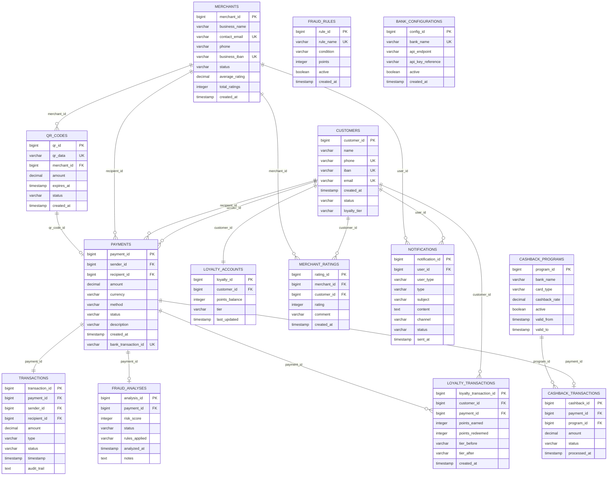

## Entity Relationship Diagram

```mermaid
erDiagram
    CUSTOMERS {
        bigint customer_id PK
        varchar name
        varchar phone UK
        varchar iban UK
        varchar email UK
        timestamp created_at
        varchar status
        varchar loyalty_tier
    }

    MERCHANTS {
        bigint merchant_id PK
        varchar business_name
        varchar contact_email UK
        varchar phone
        varchar business_iban UK
        varchar status
        decimal average_rating
        integer total_ratings
        timestamp created_at
    }

    PAYMENTS {
        bigint payment_id PK
        bigint sender_id FK
        bigint recipient_id FK
        decimal amount
        varchar currency
        varchar method
        varchar status
        varchar description
        timestamp created_at
        varchar bank_transaction_id UK
    }

    TRANSACTIONS {
        bigint transaction_id PK
        bigint payment_id FK
        bigint sender_id FK
        bigint recipient_id FK
        decimal amount
        varchar type
        varchar status
        timestamp timestamp
        text audit_trail
    }

    QR_CODES {
        bigint qr_id PK
        varchar qr_data UK
        bigint merchant_id FK
        decimal amount
        timestamp expires_at
        varchar status
        timestamp created_at
    }

    LOYALTY_ACCOUNTS {
        bigint loyalty_id PK
        bigint customer_id FK
        integer points_balance
        varchar tier
        timestamp last_updated
    }

    LOYALTY_TRANSACTIONS {
        bigint loyalty_transaction_id PK
        bigint customer_id FK
        bigint payment_id FK
        integer points_earned
        integer points_redeemed
        varchar tier_before
        varchar tier_after
        timestamp created_at
    }

    MERCHANT_RATINGS {
        bigint rating_id PK
        bigint merchant_id FK
        bigint customer_id FK
        integer rating
        varchar comment
        timestamp created_at
    }

    FRAUD_ANALYSES {
        bigint analysis_id PK
        bigint payment_id FK
        integer risk_score
        varchar status
        varchar rules_applied
        timestamp analyzed_at
        text notes
    }

    FRAUD_RULES {
        bigint rule_id PK
        varchar rule_name UK
        varchar condition
        integer points
        boolean active
        timestamp created_at
    }

    NOTIFICATIONS {
        bigint notification_id PK
        bigint user_id FK
        varchar user_type
        varchar type
        varchar subject
        text content
        varchar channel
        varchar status
        timestamp sent_at
    }

    CASHBACK_PROGRAMS {
        bigint program_id PK
        varchar bank_name
        varchar card_type
        decimal cashback_rate
        boolean active
        timestamp valid_from
        timestamp valid_to
    }

    CASHBACK_TRANSACTIONS {
        bigint cashback_id PK
        bigint payment_id FK
        bigint program_id FK
        decimal amount
        varchar status
        timestamp processed_at
    }

    BANK_CONFIGURATIONS {
        bigint config_id PK
        varchar bank_name UK
        varchar api_endpoint
        varchar api_key_reference
        boolean active
        timestamp created_at
    }

    %% Relationships
    CUSTOMERS ||--o{ PAYMENTS : "sender_id"
    CUSTOMERS ||--o{ PAYMENTS : "recipient_id"
    CUSTOMERS ||--|| LOYALTY_ACCOUNTS : "customer_id"
    CUSTOMERS ||--o{ MERCHANT_RATINGS : "customer_id"
    CUSTOMERS ||--o{ LOYALTY_TRANSACTIONS : "customer_id"
    CUSTOMERS ||--o{ NOTIFICATIONS : "user_id"

    MERCHANTS ||--o{ PAYMENTS : "recipient_id"
    MERCHANTS ||--o{ QR_CODES : "merchant_id"
    MERCHANTS ||--o{ MERCHANT_RATINGS : "merchant_id"
    MERCHANTS ||--o{ NOTIFICATIONS : "user_id"

    PAYMENTS ||--|| TRANSACTIONS : "payment_id"
    PAYMENTS ||--o| FRAUD_ANALYSES : "payment_id"
    PAYMENTS ||--o{ LOYALTY_TRANSACTIONS : "payment_id"
    PAYMENTS ||--o| CASHBACK_TRANSACTIONS : "payment_id"

    QR_CODES ||--o| PAYMENTS : "qr_code_id"

    CASHBACK_PROGRAMS ||--o{ CASHBACK_TRANSACTIONS : "program_id"
```
