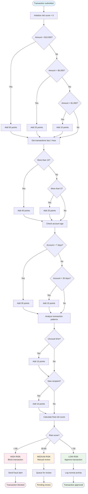

## Flowchart - Fraud Detection Logic

```mermaid
flowchart TD
    Start([Transaction submitted])
    InitScore[Initialize risk score = 0]

    Start --> InitScore
    InitScore --> AmountCheck{Amount > $10,000?}

    AmountCheck -->|Yes| HighAmount[Add 50 points]
    AmountCheck -->|No| MediumAmount{Amount > $5,000?}

    MediumAmount -->|Yes| MedAmountAdd[Add 25 points]
    MediumAmount -->|No| LowAmount{Amount > $1,000?}

    LowAmount -->|Yes| LowAmountAdd[Add 10 points]
    LowAmount -->|No| FrequencyCheck

    HighAmount --> FrequencyCheck
    MedAmountAdd --> FrequencyCheck
    LowAmountAdd --> FrequencyCheck

    FrequencyCheck[Get transactions last 1 hour]
    FrequencyCheck --> FreqEval{More than 10?}

    FreqEval -->|Yes| HighFreq[Add 40 points]
    FreqEval -->|No| MedFreq{More than 5?}

    MedFreq -->|Yes| MedFreqAdd[Add 20 points]
    MedFreq -->|No| AccountCheck

    HighFreq --> AccountCheck
    MedFreqAdd --> AccountCheck

    AccountCheck[Check account age]
    AccountCheck --> AgeEval{Account < 7 days?}

    AgeEval -->|Yes| NewAccount[Add 30 points]
    AgeEval -->|No| YoungAccount{Account < 30 days?}

    YoungAccount -->|Yes| YoungAdd[Add 15 points]
    YoungAccount -->|No| PatternCheck

    NewAccount --> PatternCheck
    YoungAdd --> PatternCheck

    PatternCheck[Analyze transaction patterns]
    PatternCheck --> UnusualTime{Unusual time?}

    UnusualTime -->|Yes| TimeAdd[Add 15 points]
    UnusualTime -->|No| NewRecipient{New recipient?}

    TimeAdd --> NewRecipient
    NewRecipient -->|Yes| RecipientAdd[Add 10 points]
    NewRecipient -->|No| FinalScore

    RecipientAdd --> FinalScore[Calculate final risk score]

    FinalScore --> ScoreEval{Risk score?}

    ScoreEval -->|> 80| HighRisk[HIGH RISK<br/>Block transaction]
    ScoreEval -->|50-80| MediumRisk[MEDIUM RISK<br/>Manual review]
    ScoreEval -->|< 50| LowRisk[LOW RISK<br/>Approve transaction]

    HighRisk --> AlertAdmin[Send fraud alert]
    MediumRisk --> QueueReview[Queue for review]
    LowRisk --> LogNormal[Log normal activity]

    AlertAdmin --> BlockEnd([Transaction blocked])
    QueueReview --> ReviewEnd([Pending review])
    LogNormal --> ApproveEnd([Transaction approved])

    style Start fill:#e1f5fe
    style HighRisk fill:#ffebee
    style MediumRisk fill:#fff3e0
    style LowRisk fill:#e8f5e8
    style BlockEnd fill:#ffebee
    style ReviewEnd fill:#fff3e0
    style ApproveEnd fill:#e8f5e8
```
