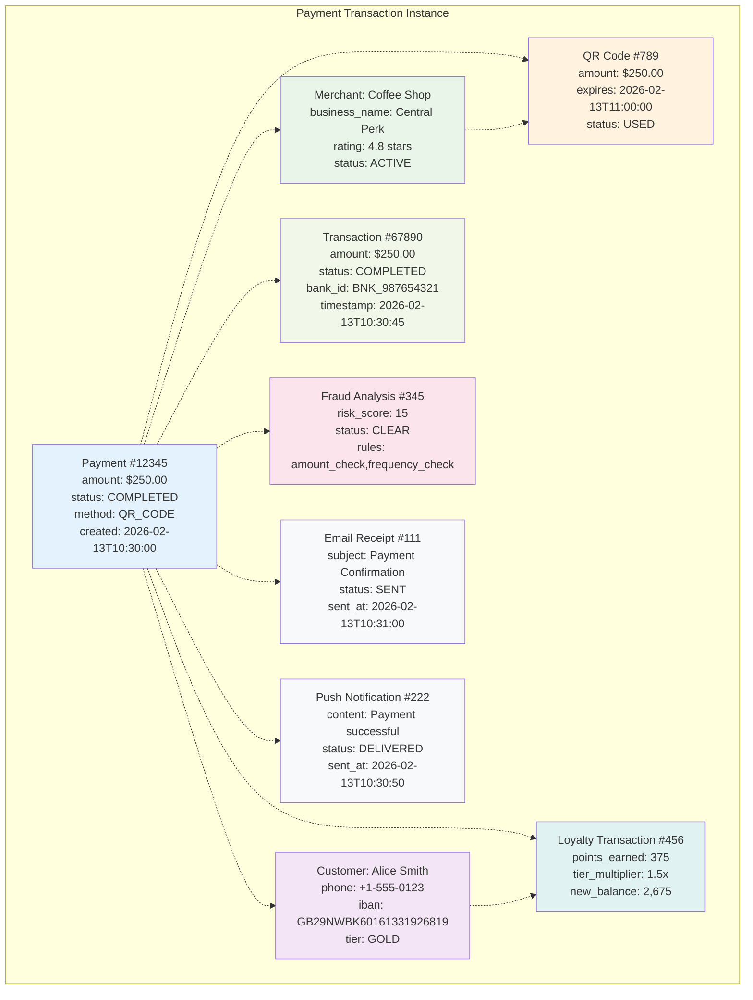

## Object Diagram - Payment Transaction Example

These diagrams provide comprehensive views of the system architecture, data relationships, state management, process flows, and fraud detection logic, all aligned with the enterprise-grade requirements specified in the kata.
