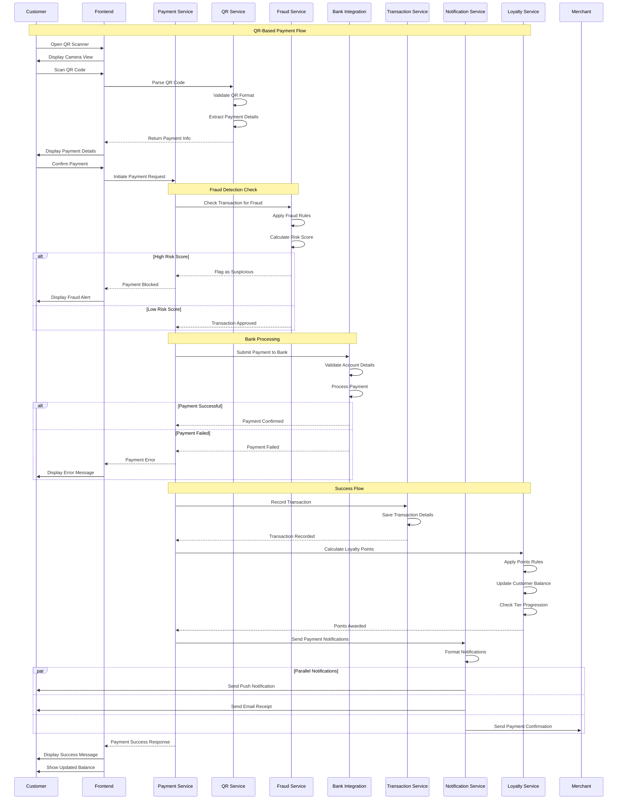
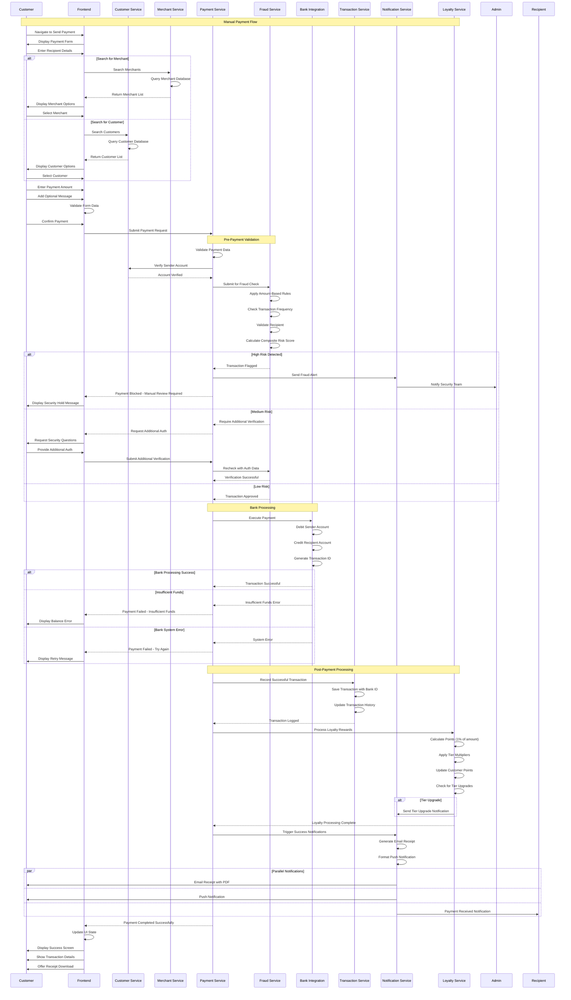
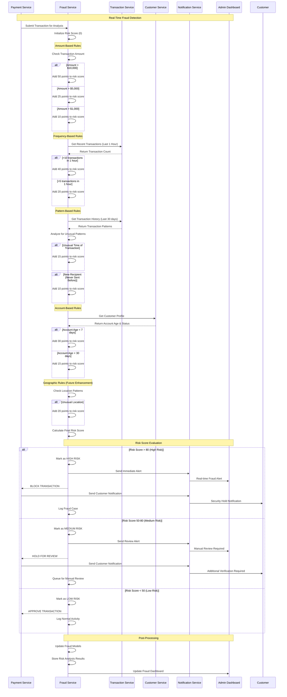
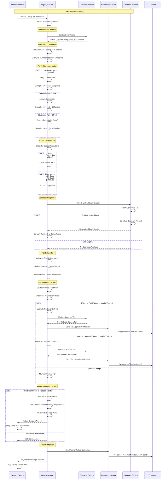

# Sequence Diagrams

## 1. Payment with QR Code

## 2. Payment without QR Code (Manual Payment)

## 3. Fraud Detection Flow

## 4. Loyalty Allocation Flow

## Key Sequence Diagram Notes

### QR Payment Highlights:

- **Real-time fraud detection** before bank processing
- **Parallel notifications** for efficiency
- **Automatic loyalty points** calculation and tier checks
- **Comprehensive error handling** at each stage

### Manual Payment Highlights:

- **Multi-level fraud detection** with escalating security measures
- **Flexible recipient search** (customers or merchants)
- **Robust bank integration** with multiple failure scenarios
- **Rich notification system** with multiple channels

### Fraud Detection Highlights:

- **Rule-based scoring system** with configurable thresholds
- **Real-time analysis** with immediate blocking capability
- **Manual review workflow** for medium-risk transactions
- **Comprehensive logging** for audit and improvement

### Loyalty Allocation Highlights:

- **Tier-based multipliers** for customer retention
- **Dynamic tier progression** with automatic upgrades
- **Cashback integration** for additional value
- **Real-time points redemption** during payment

These sequences demonstrate the production-ready, enterprise-grade architecture with proper error handling, security, and user experience considerations.
