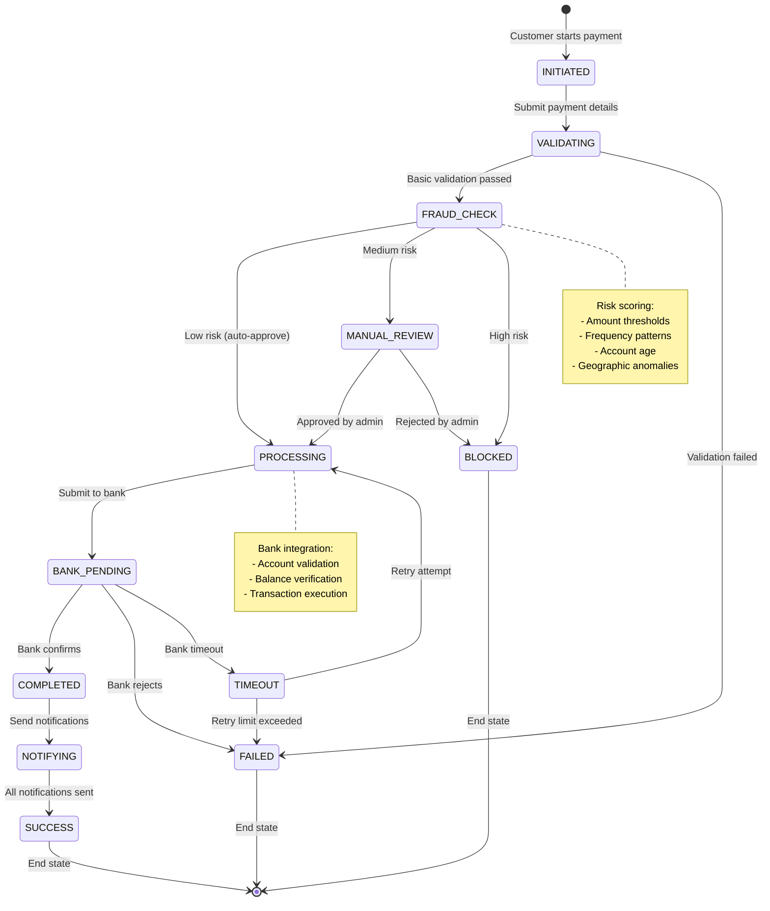

## State Diagram - Payment Lifecycle

```mermaid
stateDiagram-v2
    [*] --> INITIATED : Customer starts payment

    INITIATED --> VALIDATING : Submit payment details
    VALIDATING --> FRAUD_CHECK : Basic validation passed
    VALIDATING --> FAILED : Validation failed

    FRAUD_CHECK --> PROCESSING : Low risk (auto-approve)
    FRAUD_CHECK --> MANUAL_REVIEW : Medium risk
    FRAUD_CHECK --> BLOCKED : High risk

    MANUAL_REVIEW --> PROCESSING : Approved by admin
    MANUAL_REVIEW --> BLOCKED : Rejected by admin

    PROCESSING --> BANK_PENDING : Submit to bank
    BANK_PENDING --> COMPLETED : Bank confirms
    BANK_PENDING --> FAILED : Bank rejects
    BANK_PENDING --> TIMEOUT : Bank timeout

    TIMEOUT --> FAILED : Retry limit exceeded
    TIMEOUT --> PROCESSING : Retry attempt

    COMPLETED --> NOTIFYING : Send notifications
    NOTIFYING --> SUCCESS : All notifications sent

    FAILED --> [*] : End state
    BLOCKED --> [*] : End state
    SUCCESS --> [*] : End state

    note right of FRAUD_CHECK
        Risk scoring:
        - Amount thresholds
        - Frequency patterns
        - Account age
        - Geographic anomalies
    end note

    note right of PROCESSING
        Bank integration:
        - Account validation
        - Balance verification
        - Transaction execution
    end note
```
