# Use Case Diagram

```mermaid
flowchart TB
    subgraph "Digital Payment System"
        subgraph "Customer Use Cases"
            UC1[Register Account]
            UC2[Make QR Payment]
            UC3[Make Manual Payment]
            UC4[Scan QR Code]
            UC5[Download QR Code]
            UC6[View Transaction History]
            UC7[Rate Merchant]
            UC8[Manage Loyalty Points]
            UC9[Redeem Points]
            UC10[Update Profile]
        end

        subgraph "Merchant Use Cases"
            UC11[Accept Payment]
            UC12[Generate QR Code]
            UC13[View Payment History]
            UC14[Update Business Profile]
            UC15[View Ratings]
        end

        subgraph "Authorized Personnel Use Cases"
            UC16[Onboard Merchant]
            UC17[Verify Merchant]
            UC18[Manage Merchant Status]
            UC19[Review Merchant Applications]
            UC20[Monitor Merchant Performance]
        end

        subgraph "System Administrator Use Cases"
            UC21[Configure Cashback Programs]
            UC22[Manage Loyalty Tiers]
            UC23[Configure Fraud Rules]
            UC24[View System Analytics]
            UC25[Manage User Accounts]
            UC26[Monitor System Health]
        end

        subgraph "System Use Cases"
            UC27[Detect Fraud]
            UC28[Send Notifications]
            UC29[Process Bank Integration]
            UC30[Calculate Loyalty Points]
            UC31[Send Email Receipts]
            UC32[Validate Transactions]
        end
    end

    subgraph "Actors"
        Customer((Customer))
        Merchant((Merchant))
        AuthPersonnel((Authorized<br/>Personnel))
        SysAdmin((System<br/>Administrator))
        BankSystem((Bank<br/>System))
        FraudSystem((Fraud<br/>Detection<br/>System))
        NotificationSystem((Notification<br/>System))
    end

    %% Customer relationships
    Customer --> UC1
    Customer --> UC2
    Customer --> UC3
    Customer --> UC4
    Customer --> UC5
    Customer --> UC6
    Customer --> UC7
    Customer --> UC8
    Customer --> UC9
    Customer --> UC10

    %% Merchant relationships
    Merchant --> UC11
    Merchant --> UC12
    Merchant --> UC13
    Merchant --> UC14
    Merchant --> UC15

    %% Authorized Personnel relationships
    AuthPersonnel --> UC16
    AuthPersonnel --> UC17
    AuthPersonnel --> UC18
    AuthPersonnel --> UC19
    AuthPersonnel --> UC20

    %% System Administrator relationships
    SysAdmin --> UC21
    SysAdmin --> UC22
    SysAdmin --> UC23
    SysAdmin --> UC24
    SysAdmin --> UC25
    SysAdmin --> UC26

    %% System actor relationships
    BankSystem --> UC29
    FraudSystem --> UC27
    NotificationSystem --> UC28
    NotificationSystem --> UC31

    %% System internal relationships
    UC2 -.-> UC27
    UC3 -.-> UC27
    UC2 -.-> UC28
    UC3 -.-> UC28
    UC2 -.-> UC29
    UC3 -.-> UC29
    UC2 -.-> UC30
    UC3 -.-> UC30
    UC2 -.-> UC31
    UC3 -.-> UC31
    UC11 -.-> UC32

    %% Include relationships
    UC2 -.->|includes| UC4
    UC3 -.->|includes| UC32
    UC11 -.->|includes| UC32
    UC1 -.->|includes| UC8

    %% Extend relationships
    UC2 -.->|extends| UC9
    UC3 -.->|extends| UC9
    UC6 -.->|extends| UC7

    classDef actor fill:#e1f5fe
    classDef usecase fill:#f3e5f5
    classDef system fill:#fff3e0

    class Customer,Merchant,AuthPersonnel,SysAdmin,BankSystem,FraudSystem,NotificationSystem actor
    class UC1,UC2,UC3,UC4,UC5,UC6,UC7,UC8,UC9,UC10,UC11,UC12,UC13,UC14,UC15,UC16,UC17,UC18,UC19,UC20,UC21,UC22,UC23,UC24,UC25,UC26 usecase
    class UC27,UC28,UC29,UC30,UC31,UC32 system
```

## Use Case Descriptions

### Summary

#### Customer
- The Customer registers, manages their account, and performs payments using QR or manual methods while tracking transactions and loyalty benefits. They can rate merchants, redeem points, and interact with QR-based payment features seamlessly.

#### Merchant
- The Merchant generates and accepts QR-based payments, manages their business profile, and monitors payment history. They can also view customer ratings and feedback to improve their services.

#### Authorized Personnel
- Authorized Personnel review and process merchant onboarding applications to ensure compliance and approval standards are met. They verify submitted information and decide whether to approve or reject applications.

#### System Administrator
- The System Administrator configures and maintains system rules such as cashback programs and fraud detection parameters. They ensure system policies are updated, tested, and properly deployed.

#### Fraud Detection System
- The Fraud Detection System continuously monitors transactions in real time to detect suspicious activity. It applies predefined rules to calculate fraud scores and generate alerts when necessary.

### Customer Use Cases

**UC1: Register Account**

- **Actor**: Customer
- **Description**: Customer registers with name, phone, and IBAN
- **Preconditions**: None
- **Postconditions**: Customer account created, auto-enrolled in loyalty program
- **Main Flow**: Provide details → Validate IBAN → Create account → Send confirmation

**UC2: Make QR Payment**

- **Actor**: Customer
- **Description**: Customer scans QR code to make payment
- **Preconditions**: Customer logged in, QR code available
- **Postconditions**: Payment processed, notifications sent
- **Main Flow**: Scan QR → Confirm details → Authorize → Process payment

**UC3: Make Manual Payment**

- **Actor**: Customer
- **Description**: Customer enters recipient and amount manually
- **Preconditions**: Customer logged in
- **Postconditions**: Payment processed, notifications sent
- **Main Flow**: Select recipient → Enter amount → Authorize → Process payment

**UC4: Scan QR Code**

- **Actor**: Customer
- **Description**: Customer scans QR code to extract payment details
- **Preconditions**: QR code available, camera access granted
- **Postconditions**: Payment details populated
- **Main Flow**: Open scanner → Scan code → Extract details → Populate form

**UC5: Download QR Code**

- **Actor**: Customer
- **Description**: Customer downloads QR code for payment request
- **Preconditions**: Customer logged in
- **Postconditions**: QR code downloaded to device
- **Main Flow**: Request QR → Generate code → Download file

**UC6: View Transaction History**

- **Actor**: Customer
- **Description**: Customer views past transactions (5 years)
- **Preconditions**: Customer logged in
- **Postconditions**: Transaction history displayed
- **Main Flow**: Navigate to history → Apply filters → View transactions

**UC7: Rate Merchant**

- **Actor**: Customer
- **Description**: Customer rates merchant after transaction
- **Preconditions**: Completed transaction with merchant
- **Postconditions**: Rating saved and aggregated
- **Main Flow**: Select transaction → Provide rating → Submit feedback

**UC8: Manage Loyalty Points**

- **Actor**: Customer
- **Description**: Customer views points balance and tier status
- **Preconditions**: Customer logged in, loyalty program active
- **Postconditions**: Loyalty information displayed
- **Main Flow**: View dashboard → Check points → Review tier benefits

**UC9: Redeem Points**

- **Actor**: Customer
- **Description**: Customer uses points during payment
- **Preconditions**: Sufficient points available, making payment
- **Postconditions**: Points deducted, payment amount reduced
- **Main Flow**: Select redemption → Calculate discount → Apply to payment

### Merchant Use Cases

**UC11: Accept Payment**

- **Actor**: Merchant
- **Description**: Merchant receives payment from customer
- **Preconditions**: Merchant account active
- **Postconditions**: Payment received, notification sent
- **Main Flow**: Generate request → Receive payment → Confirm transaction

**UC12: Generate QR Code**

- **Actor**: Merchant
- **Description**: Merchant generates QR code for payment request
- **Preconditions**: Merchant logged in
- **Postconditions**: QR code generated and displayed
- **Main Flow**: Enter amount → Generate QR → Display code

**UC13: View Payment History**

- **Actor**: Merchant
- **Description**: Merchant views received payments
- **Preconditions**: Merchant logged in
- **Postconditions**: Payment history displayed
- **Main Flow**: Access dashboard → View transactions → Apply filters

**UC14: Update Business Profile**

- **Actor**: Merchant
- **Description**: Merchant updates business information
- **Preconditions**: Merchant logged in
- **Postconditions**: Profile updated, changes saved
- **Main Flow**: Edit profile → Validate changes → Save updates

**UC15: View Ratings**

- **Actor**: Merchant
- **Description**: Merchant views customer ratings and feedback
- **Preconditions**: Merchant logged in
- **Postconditions**: Ratings and feedback displayed
- **Main Flow**: Access ratings → View scores → Read feedback

### Administrative Use Cases

**UC16: Onboard Merchant**

- **Actor**: Authorized Personnel
- **Description**: Staff processes merchant onboarding application
- **Preconditions**: Merchant application submitted
- **Postconditions**: Merchant onboarded or rejected
- **Main Flow**: Review application → Verify information → Approve/Reject

**UC21: Configure Cashback Programs**

- **Actor**: System Administrator
- **Description**: Admin configures cashback rates for bank cards
- **Preconditions**: Admin logged in
- **Postconditions**: Cashback rules updated
- **Main Flow**: Select bank cards → Set rates → Save configuration

**UC23: Configure Fraud Rules**

- **Actor**: System Administrator
- **Description**: Admin updates fraud detection rules
- **Preconditions**: Admin logged in
- **Postconditions**: Fraud rules updated
- **Main Flow**: Access rules → Modify parameters → Test rules → Deploy

### System Use Cases

**UC27: Detect Fraud**

- **Actor**: Fraud Detection System
- **Description**: System monitors and flags suspicious transactions
- **Preconditions**: Transaction in progress
- **Postconditions**: Fraud score calculated, alerts generated if needed
- **Main Flow**: Analyze transaction → Apply rules → Calculate score → Generate alerts

**UC28: Send Notifications**

- **Actor**: Notification System
- **Description**: System sends multi-channel notifications
- **Preconditions**: Notification trigger event
- **Postconditions**: Notification delivered via appropriate channel
- **Main Flow**: Receive trigger → Format message → Select channel → Send notification

**UC29: Process Bank Integration**

- **Actor**: Bank System
- **Description**: External bank processes payment transaction
- **Preconditions**: Payment request received
- **Postconditions**: Payment processed or failed
- **Main Flow**: Validate request → Process payment → Return status

**UC30: Calculate Loyalty Points**

- **Actor**: System
- **Description**: System calculates and assigns loyalty points
- **Preconditions**: Transaction completed
- **Postconditions**: Points calculated and assigned
- **Main Flow**: Calculate points → Update balance → Check tier progression
